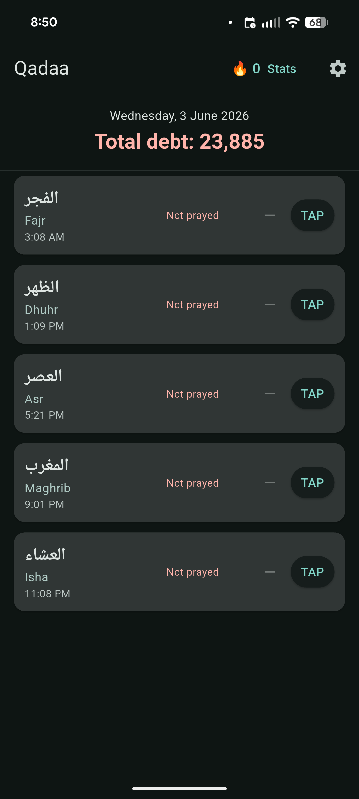
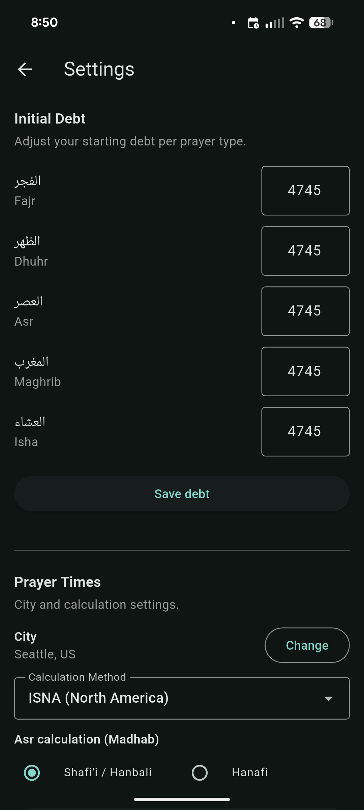
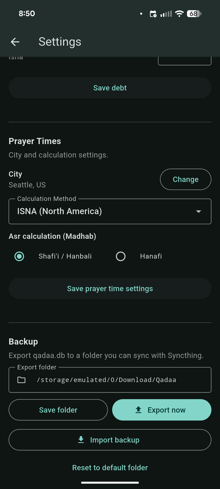

# Qadaa

A local-only Android app for tracking and making up missed Islamic (fard) prayers.

No backend. No accounts. Your data stays on your device.

---

## Screenshots

| Home | Settings — Debt & Prayer Times | Settings — Backup |
|---|---|---|
|  |  |  |

---

## Features

- **Prayer debt tracking** — log each of the 5 daily prayers as missed or made up
- **Debt calculator** — derives current debt fresh from initial debt + missed days − makeups (never stored as a running total, avoids drift)
- **Prayer times** — calculated on-device using the [adhan](https://pub.dev/packages/adhan) library with configurable city, calculation method, madhab, and high-latitude rule
- **Streak tracking** — consecutive complete days with persistence of best streak
- **Home screen widget** — shows streak, debt, and 5 prayer tap buttons; works while the app is closed
- **Streak notification** — 9 PM daily alert that adapts based on streak and remaining prayers
- **Database export** — checkpoints WAL and copies `qadaa.db` to a configurable folder for Syncthing backup
- **Database import** — restore from a backup file via file picker
- **Jumu'ah handling** — Friday Dhuhr replaced with Jumu'ah
- **Dark mode**

---

## Tech stack

| Layer | Choice |
|---|---|
| Framework | Flutter (Dart) |
| State management | Riverpod (code-gen) |
| Database | SQLite via sqflite, WAL mode |
| Prayer times | adhan ^2.0.0 |
| Notifications | flutter_local_notifications ^17 |
| Home widget | home_widget ^0.7.0 |
| City dataset | GeoNames top-2000 cities (147 KB JSON) |

---

## Project structure

```
lib/
  data/           # Repositories + ExportService (DatabaseHelper, PrayerRepository, SettingsRepository)
  domain/
    models/       # Prayer, Debt, Streak models
    services/     # DebtCalculator, StreakCalculator, PrayerTimeService
  notifications/  # StreakNotifier
  ui/
    screens/
      setup/      # Welcome → BirthYear → AdjustDebt → City → Method
      home/       # HomeScreen + prayer cards
      stats/      # StatsScreen (debt table, streak)
      settings/   # SettingsScreen (initial debts, prayer times, export/import)
  providers.dart
  main.dart
android/
  app/src/main/kotlin/.../
    QadaaWidgetProvider.kt
    BootReceiver.kt
assets/
  cities.json
test/
  debt_calculator_test.dart
  streak_calculator_test.dart
```

---

## Build & run

```bash
flutter pub get
flutter run          # debug, hot-reload
flutter build apk --release && adb install -r build/app/outputs/flutter-apk/app-release.apk
```

Or use the included scripts (require a connected device via ADB):

```bash
./run-debug.sh       # flutter run (debug, live reload)
./run-install.sh     # build release APK + adb install -r
```

Requires Android (API 21+). iOS is deferred to v2.

---

## Data & backup

All data lives in the app's internal SQLite database (`qadaa.db`). The database stores:
- Prayer entries (missed / made up per day)
- Initial debt per prayer type
- App settings (city, calculation method, madhab, export folder, best streak, etc.)

To back up:

1. Go to **Settings → Backup**
2. Set the export folder (default: `/storage/emulated/0/Download/Qadaa/`)
3. Tap **Export now** — the app checkpoints the WAL and copies a clean `qadaa.db`

To restore:

1. Go to **Settings → Backup → Import backup**
2. Confirm the warning, then pick a `qadaa.db` file
3. All providers reload automatically

Point Syncthing at the export folder to sync to other devices.

`Download/` is used (not `Android/data/`) because app-specific external storage is sandboxed and invisible to Syncthing.

---

## Permissions

| Permission | Why |
|---|---|
| `SCHEDULE_EXACT_ALARM` | 9 PM streak notification |
| `RECEIVE_BOOT_COMPLETED` | Reschedule notification + redraw widget after reboot |
| `MANAGE_EXTERNAL_STORAGE` (Android 11+) | Write to Download/ for backup |

---

## Tests

```bash
flutter test
```

15 unit tests covering debt calculation and streak logic.

---

## Package

`com.yasir.qadaa`
